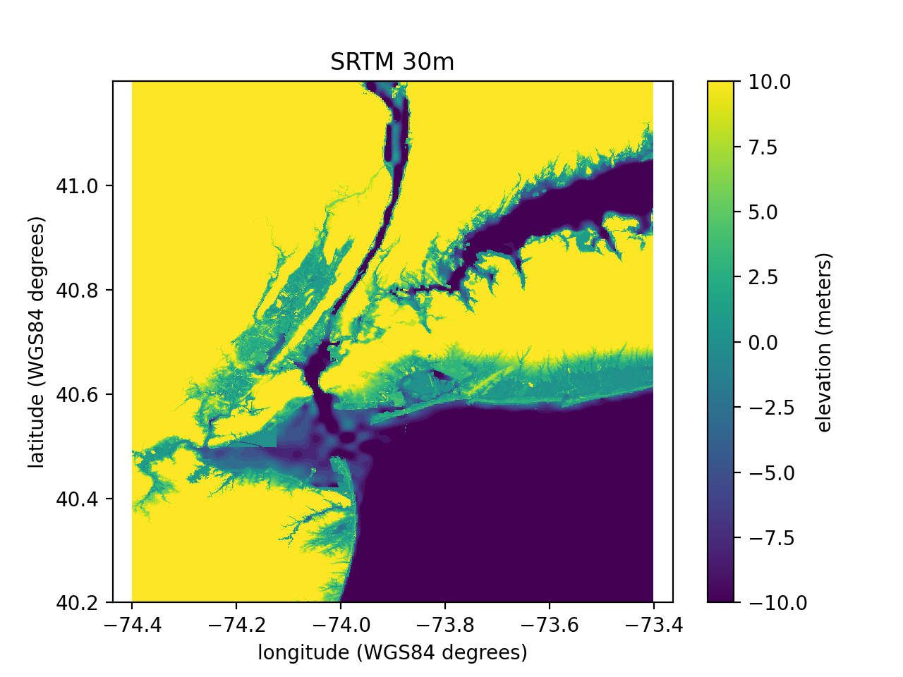
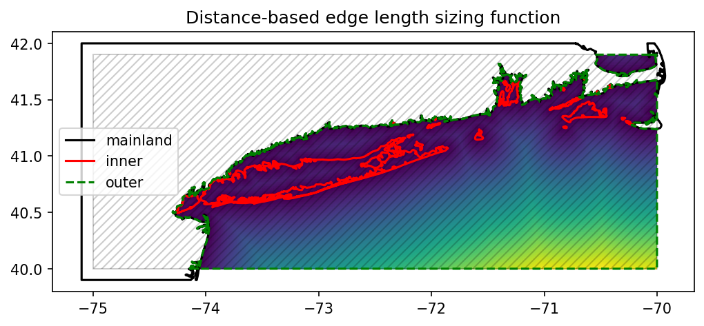
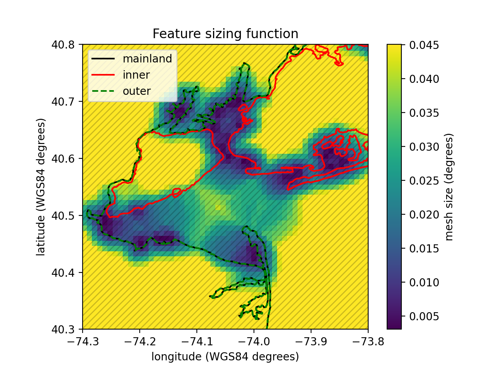
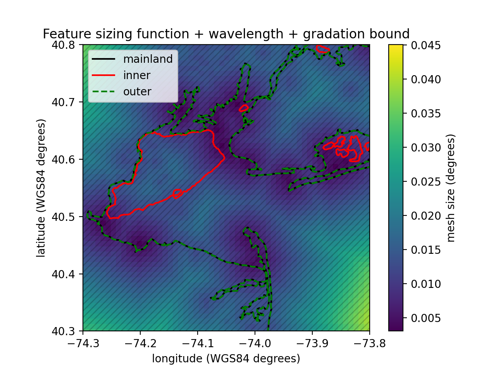
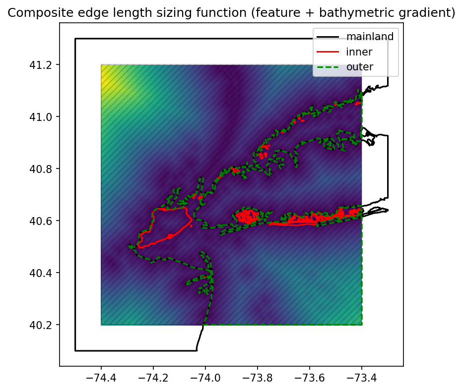
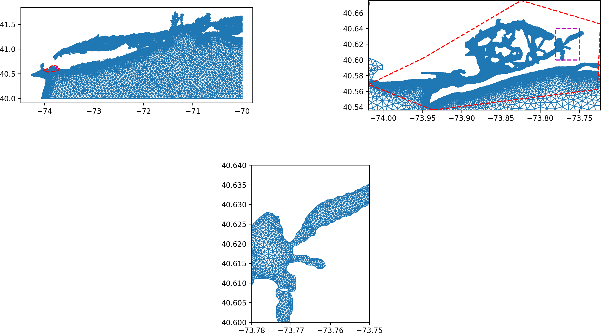

# oceanmesh: Automatic coastal ocean mesh generation

:ocean: :cyclone:

[](https://github.com/CHLNDDEV/oceanmesh/actions/workflows/testing.yml)

[](https://codecov.io/gh/CHLNDDEV/oceanmesh)

Coastal ocean mesh generation from vector and raster GIS data.

---

## 1. Quick Start

Get a mesh up and running in minutes. For a full walkthrough, see 5. Basic Usage.

<!--pytest-codeblocks:skip-->

```python
import numpy as np
import oceanmesh as om

# 1) Define a region (WGS84 example)
region = om.Region(extent=(-75.00, -70.00, 40.00, 42.00), crs=4326)

# Alternatively, define an arbitrary polygon extent (lon, lat vertices)
poly_vertices = np.array(
  [
    [-74.2, 40.4],
    [-73.9, 40.4],
    [-73.8, 40.7],
    [-74.1, 40.8],
    [-74.2, 40.4],  # close polygon
  ]
)
poly_region = om.Region(extent=poly_vertices, crs=4326)

# 2) Build shoreline and signed distance function from a coastline shapefile
shore = om.Shoreline("path/to/coastline.shp", poly_region, min_edge_length=0.01)
sdf = om.signed_distance_function(shore)

# 3) Create a sizing function and generate the mesh
edge = om.distance_sizing_function(shore, rate=0.15)
points, cells = om.generate_mesh(sdf, edge)

# 4) Clean up common boundary issues
points, cells = om.make_mesh_boundaries_traversable(points, cells)
points, cells = om.delete_boundary_faces(points, cells, min_qual=0.15)
```

[Back to top](#table-of-contents)

---

## Table of contents

<!--ts-->

- [1. Quick Start](#1-quick-start)
- [2. Features](#2-features)
- [3. Installation](#3-installation)
  - [3.1 Linux/Mac](#31-linuxmac)
  - [3.2 Windows](#32-windows)
  - [3.3 Development installation](#33-development-installation)
- [4. Support & Community](#4-support--community)
- [5. Basic Usage](#5-basic-usage)
  - [5.1 Setting the Region](#51-setting-the-region)
  - [5.2 Reading Geophysical Data](#52-reading-geophysical-data)
  - [5.3 Defining the Domain](#53-defining-the-domain)
  - [5.4 Building Mesh Sizing Functions](#54-building-mesh-sizing-functions)
  - [5.5 Cleaning up the Mesh](#55-cleaning-up-the-mesh)
  - [5.6 Mesh Generation](#56-mesh-generation)
- [6. Advanced Topics](#6-advanced-topics)
  - [6.1 Multiscale Mesh Generation](#61-multiscale-mesh-generation)
  - [6.2 Global and Multiscale Meshing](#62-global-and-multiscale-meshing)
- [7. Performance Optimization](#7-performance-optimization)
- [8. Third-Party Code](#8-third-party-code)
- [9. Testing](#9-testing)
- [10. Citation](#10-citation)
- [11. License](#11-license)

<!--te-->

---

## 2. Features

- A Python package for the development of unstructured triangular meshes used in coastal ocean circulation modeling. The software integrates mesh generation directly with geophysical datasets such as topo-bathymetric rasters/digital elevation models and shapefiles representing coastal features. It provides pre- and post-processing tools to enable successful numerical simulation with the developed model.
  - Automatically handles arbitrarily complex shoreline vector datasets and incorporates them into mesh generation.
  - A variety of commonly used mesh size functions with simple, scriptable controls.
  - Mesh checking and clean-up methods to avoid simulation problems.

[Back to top](#table-of-contents)

---

## 3. Installation

:warning: Active development. Installation is currently recommended for developers. A stable API will be published to PyPI later.

The notes below refer to installation on platforms other than MS Windows. For Windows, see 3.2.

### 3.1 Linux/Mac

oceanmesh needs [CGAL](https://www.cgal.org/):

```bash
sudo apt install libcgal-dev
```

CGAL can also be installed with conda:

<!--pytest-codeblocks:skip-->
```bash
conda install -c conda-forge cgal
```

After that, clone the repo and install/update with pip:

```bash
pip install -U -e .
```

On some clusters/HPC in order to install CGAL, you may need to load/install [gmp](https://gmplib.org/) and [mpfr](https://www.mpfr.org/). For example:

```bash
sudo apt install libmpfr-dev libgmp3-dev
```

### 3.2 Windows

Python on Windows can encounter DLL conflicts due to version incompatibilities among required packages. We provide `install_cgal.bat` to build a CGAL development distribution separately as a prerequisite.

Prerequisites to build CGAL using the provided batch file:

- Windows 10 or later
- Visual Studio with C++
- CMake
- Git

After successful installation of a CGAL development package, proceed via one of the two options below to generate a Python environment with OceanMesh installed.
performance-critical operations:
If you are using a conda-based Python distribution, then `install_oceanmesh.bat` should take care of everything, provided no package conflicts arise.
-  **Point-in-polygon queries** are implemented by
   :mod:`oceanmesh.geometry.point_in_polygon` using a pure-Python
   ray-casting backend with optional fast paths via Shapely and
   Matplotlib when available. When built, an optional Cython extension
   (:mod:`oceanmesh.geometry.point_in_polygon_`) can accelerate the
   core ray-casting kernel.

   Backend selection follows two environment variables:

   - ``OCEANMESH_INPOLY_METHOD`` chooses among the Python backends
     (``"raycasting"``, ``"shapely"``, ``"matplotlib"``). When this is
     set, the corresponding backend is used and the Cython kernel is
     not invoked.
   - ``OCEANMESH_INPOLY_ACCEL`` controls whether the compiled kernel is
     considered when ``OCEANMESH_INPOLY_METHOD`` is *not* set to a
     recognised method name. In this case, if the extension is
     available, the Cython kernel is tried first and the code
     gracefully falls back to the pure-Python implementation if the
     import or call fails.

   This keeps installations robust while allowing users to explicitly
   select a backend for debugging or reproducibility, and to benefit
   from additional speed on platforms with a C compiler toolchain.

Note: CMake is required by vcpkg to build CGAL dependencies, but is not used to build oceanmesh itself (which uses setuptools with pybind11).

### 3.3 Development installation

To install from source for development and testing:

```bash
pip install -e .
```

[Back to top](#table-of-contents)

---

## 4. Support & Community

- Questions or problems? Post issues on GitHub or ask in Slack: https://join.slack.com/t/oceanmesh2d/shared_invite/zt-su1q3lh3-C_j6AIOQPrewqZnanhzN7g
- Contact: Dr. Keith Roberts (keithrbt0@gmail.com)
- Version information: oceanmesh uses versioneer.
<!--pytest-codeblocks:skip-->
```bash
python -c "import oceanmesh; print(oceanmesh.__version__)"
python setup.py version
```

Logging during script execution (default is suppressed):

```python
import logging, sys
logging.basicConfig(stream=sys.stdout, level=logging.WARNING)
# logging.basicConfig(stream=sys.stdout, level=logging.INFO)
# logging.basicConfig(stream=sys.stdout, level=logging.DEBUG)
```

[Back to top](#table-of-contents)

---

## 5. Basic Usage

### 5.1 Setting the Region

```python
import oceanmesh as om

EPSG = 32619  # CRS (UTM19N here)
bbox = (-70.29637, -43.56508, -69.65537, 43.88338)
extent = om.Region(extent=bbox, crs=4326)  # bbox given in WGS84
extent = extent.transform_to(EPSG)         # transform to target CRS (UTM19N)
print(extent.bbox)                         # extents now in desired CRS
```

### 5.2 Reading Geophysical Data

Shoreline vector datasets (e.g., shapefiles) and digital elevation models (DEMs) are used to construct mesh size and signed distance functions. The dataset download and heavy plotting examples are skipped in CI.

<!--pytest-codeblocks:skip-->

```python
import zipfile
import requests
import oceanmesh as om

url = "http://www.soest.hawaii.edu/pwessel/gshhg/gshhg-shp-2.3.7.zip"
with open("gshhg-shp-2.3.7.zip", "wb") as f:
    f.write(requests.get(url).content)
zipfile.ZipFile("gshhg-shp-2.3.7.zip").extractall("gshhg-shp-2.3.7")

fname = "gshhg-shp-2.3.7/GSHHS_shp/f/GSHHS_f_L1.shp"
EPSG = 4326
extent = om.Region(extent=(-75.000, -70.001, 40.0001, 41.9000), crs=EPSG)
shoreline = om.Shoreline(fname, extent, 0.01)  # Preferred: pass Region
```

#### Working with Projected Coordinate Systems

When working in projected CRSs (e.g., UTM), prefer passing a Region object so both bbox and CRS travel together.

<!--pytest-codeblocks:skip-->

```python
import oceanmesh as om

EPSG = 32610  # UTM Zone 10N
extent = om.Region(extent=(xmin, xmax, ymin, ymax), crs=EPSG)

shore = om.Shoreline(fname, extent, min_edge_length=15)               # carries CRS
shore = om.Shoreline(fname, extent.bbox, 15, crs=EPSG)                 # explicit CRS
# Wrong: bbox in UTM but default CRS=WGS84 (do NOT do this)
# shore = om.Shoreline(fname, extent.bbox, 15)
```

> Best practice: Pass a Region object to Shoreline instead of just a bbox to ensure CRS matches automatically.

<!--pytest-codeblocks:skip-->

```python
# DEM usage (example dataset from datasets/EastCoast.nc)
import oceanmesh as om
dem = om.DEM("datasets/EastCoast.nc", crs=4326)
dem.plot(title="SRTM 30m", vmin=-10, vmax=10)
```



### 5.3 Defining the Domain

<!--pytest-codeblocks:skip-->

```python
import oceanmesh as om
fname = "gshhg-shp-2.3.7/GSHHS_shp/f/GSHHS_f_L1.shp"
extent = om.Region(extent=(-75.00, -70.001, 40.0001, 41.9000), crs=4326)
shoreline = om.Shoreline(fname, extent, 0.01)
sdf = om.signed_distance_function(shoreline)
```

To flip the inside/outside definition:

<!--pytest-codeblocks:skip-->

```python
sdf = om.signed_distance_function(shoreline, invert=True)
```

### 5.4 Building Mesh Sizing Functions

All mesh size functions are defined on regular Cartesian grids. See the Grid class for details.

<!--pytest-codeblocks:skip-->

```python
import oceanmesh as om
fname = "gshhg-shp-2.3.7/GSHHS_shp/f/GSHHS_f_L1.shp"
extent = om.Region(extent=(-75.00, -70.001, 40.0001, 41.9000), crs=4326)
shoreline = om.Shoreline(fname, extent, 0.01)
edge_length = om.distance_sizing_function(shoreline, rate=0.15)
```



<!--pytest-codeblocks:skip-->

```python
import oceanmesh as om
fname = "gshhg-shp-2.3.7/GSHHS_shp/f/GSHHS_f_L1.shp"
extent = om.Region(extent=(-75.00, -70.001, 40.0001, 41.9000), crs=4326)
shoreline = om.Shoreline(fname, extent, 0.01)
sdf = om.signed_distance_function(shoreline)
edge_length = om.feature_sizing_function(shoreline, sdf, max_edge_length=0.05)
edge_length = om.enforce_mesh_gradation(edge_length, gradation=0.15)
```


<!--pytest-codeblocks:skip-->

```python
import oceanmesh as om
fdem = "datasets/EastCoast.nc"
fname = "gshhg-shp-2.3.7/GSHHS_shp/f/GSHHS_f_L1.shp"
extent = om.Region(extent=(-74.3, -73.8, 40.3, 40.8), crs=4326)
dem = om.DEM(fdem, bbox=extent, crs=4326)
shoreline = om.Shoreline(fname, dem.bbox, 0.01)
sdf = om.signed_distance_function(shoreline)
edge1 = om.feature_sizing_function(shoreline, sdf, max_edge_length=0.05)
edge2 = om.wavelength_sizing_function(dem, wl=100, period=12.42 * 3600)
edge = om.enforce_mesh_gradation(om.compute_minimum([edge1, edge2]), gradation=0.15)
```



<!--pytest-codeblocks:skip-->

```python
import oceanmesh as om
fdem = "datasets/EastCoast.nc"
fname = "gshhg-shp-2.3.7/GSHHS_shp/f/GSHHS_f_L1.shp"
extent = om.Region(extent=(-74.4, -73.4, 40.2, 41.2), crs=4326)
dem = om.DEM(fdem, crs=4326)
shoreline = om.Shoreline(fname, extent, 0.0025)
sdf = om.signed_distance_function(shoreline)
edge_feat = om.feature_sizing_function(shoreline, sdf, max_edge_length=0.10, crs=4326)
edge_grad = om.bathymetric_gradient_sizing_function(
    dem, slope_parameter=5.0, filter_quotient=50, min_edge_length=0.0025, max_edge_length=0.10, crs=4326
)
edge = om.enforce_mesh_gradation(om.compute_minimum([edge_feat, edge_grad]), gradation=0.15)
```




### 5.5 Cleaning up the Mesh

<!--pytest-codeblocks:skip-->

```python
points, cells = fix_mesh(points, cells)
points, cells = make_mesh_boundaries_traversable(points, cells)
points, cells = delete_faces_connected_to_one_face(points, cells)
points, cells = delete_boundary_faces(points, cells, min_qual=0.15)
points, cells = laplacian2(points, cells)
```

### 5.6 Mesh Generation

Mesh generation uses the DistMesh algorithm and requires only a signed distance and a sizing function.

<!--pytest-codeblocks:skip-->

```python
import meshio
import oceanmesh as om
fname = "gshhg-shp-2.3.7/GSHHS_shp/f/GSHHS_f_L1.shp"
extent = om.Region(extent=(-75.00, -70.001, 40.0001, 41.9000), crs=4326)
shore = om.Shoreline(fname, extent.bbox, 0.01)
edge = om.distance_sizing_function(shore, max_edge_length=0.05)
domain = om.signed_distance_function(shore)
points, cells = om.generate_mesh(domain, edge)
points, cells = om.make_mesh_boundaries_traversable(points, cells)
points, cells = om.delete_faces_connected_to_one_face(points, cells)
points, cells = om.delete_boundary_faces(points, cells, min_qual=0.15)
points, cells = om.laplacian2(points, cells)
meshio.write_points_cells("new_york.vtk", points, [("triangle", cells)], file_format="vtk")
```

[Back to top](#table-of-contents)

---

## 6. Advanced Topics

### 6.1 Multiscale Mesh Generation

Areas of finer refinement can be incorporated seamlessly by using `generate_multiscale_mesh` with lists of signed distance and edge length functions. Transitions are blended automatically.

<!--pytest-codeblocks:skip-->

```python
import numpy as np
import matplotlib.tri as tri
import matplotlib.gridspec as gridspec
import oceanmesh as om

fname = "gshhg-shp-2.3.7/GSHHS_shp/f/GSHHS_f_L1.shp"
extent1 = om.Region(extent=(-75.00, -70.001, 40.0001, 41.9000), crs=4326)
extent2 = om.Region(extent=np.array([[-73.95, 40.60], [-73.72, 40.65], [-73.95, 40.60]]), crs=4326)
s1 = om.Shoreline(fname, extent1.bbox, 0.01)
s2 = om.Shoreline(fname, extent2.bbox, 4.6e-4)
sdf1, sdf2 = om.signed_distance_function(s1), om.signed_distance_function(s2)
el1, el2 = om.distance_sizing_function(s1, max_edge_length=0.05), om.distance_sizing_function(s2)
points, cells = om.generate_multiscale_mesh([sdf1, sdf2], [el1, el2])
```



### 6.2 Global and Multiscale Meshing

Global meshes are defined in WGS84 but meshed in a stereographic projection. Regional refinement can be added as additional domains.

<!--pytest-codeblocks:skip-->

```python
import numpy as np
import matplotlib.pyplot as plt
import matplotlib.tri as tri
import matplotlib.gridspec as gridspec
import oceanmesh as om
from oceanmesh.region import to_lat_lon

fname_global_latlon = "tests/global/global_latlon.shp"
fname_global_stereo = "tests/global/global_stereo.shp"

global_region = om.Region(extent=(-180.0, 180.0, -89.0, 90.0), crs=4326)
shoreline_global_latlon = om.Shoreline(fname_global_latlon, global_region, 1.0)
sdf_global_latlon = om.signed_distance_function(shoreline_global_latlon)
edge_global = om.enforce_mesh_gradation(
    om.compute_minimum([
        om.distance_sizing_function(shoreline_global_latlon, rate=0.11),
        om.feature_sizing_function(shoreline_global_latlon, sdf_global_latlon, max_edge_length=3.0),
    ]),
    gradation=0.15,
    stereo=True,
)

aus_region = om.Region(extent=(110.0, 160.0, -45.0, -10.0), crs=4326)
shoreline_regional = om.Shoreline(fname_global_latlon, aus_region, 0.25)
sdf_regional = om.signed_distance_function(shoreline_regional)
edge_regional = om.enforce_mesh_gradation(
    om.compute_minimum([
        om.distance_sizing_function(shoreline_regional, rate=0.13),
        om.feature_sizing_function(shoreline_regional, sdf_regional, max_edge_length=1.5),
    ]),
    gradation=0.12,
)

shoreline_global_stereo = om.Shoreline(fname_global_stereo, global_region, 1.0, stereo=True)
sdf_global_stereo = om.signed_distance_function(shoreline_global_stereo)

points, cells = om.generate_multiscale_mesh(
    [sdf_global_stereo, sdf_regional],
    [edge_global, edge_regional],
    blend_width=1.0e6,
    blend_max_iter=50,
    max_iter=75,
)
```


*The image shows the global mesh with a refined Australia region.*

<!--pytest-codeblocks:skip-->

```python
# Global mesh generation only (stereographic meshing)
import oceanmesh as om
from oceanmesh.region import to_lat_lon
fname = "tests/global/global_latlon.shp"
fname2 = "tests/global/global_stereo.shp"
region = om.Region(extent=(-180.00, 180.00, -89.00, 90.00), crs=4326)
shore = om.Shoreline(fname, region.bbox, 0.5)
edge = om.distance_sizing_function(shore, rate=0.11)
domain = om.signed_distance_function(om.Shoreline(fname2, region.bbox, 0.5, stereo=True))
points, cells = om.generate_mesh(domain, edge, stereo=True, max_iter=100)
```

[Back to top](#table-of-contents)

---

## 7. Performance Optimization

OceanMesh uses efficient, GPL-compatible geometry backends for
performance-critical operations:

- **Point-in-polygon queries** use the new
  `oceanmesh.geometry.inpoly2` implementation, which can automatically
  take advantage of Shapely prepared geometries or Matplotlib path
  operations when those libraries are available, falling back to a
  portable pure-Python ray-casting algorithm otherwise.
- **Delaunay triangulation** is provided by a pure-Python
  Bowyer–Watson implementation with an optional Cython-accelerated
  kernel, enabled automatically when built.

No special extras or build flags are required to enable these
optimizations; the fastest available backend is selected at runtime
based on the installed dependencies.

[Back to top](#table-of-contents)

---

## 8. Third-Party Code

OceanMesh relies on a number of well-established open-source
dependencies (see `setup.cfg` for the full list), but does not
currently vendor any third-party geometry libraries. Earlier releases
included a vendored copy of `inpoly-python`; this has been fully
replaced by the native GPL-compatible implementation in
`oceanmesh.geometry.inpoly2`.

[Back to top](#table-of-contents)

---

## 9. Testing

To run the oceanmesh unit tests (and turn off plots), check out this repository and run tox.

[Back to top](#table-of-contents)

---

## 10. Citation

```
[1] - Roberts, K. J., Pringle, W. J., and Westerink, J. J., 2019.
      OceanMesh2D 1.0: MATLAB-based software for two-dimensional unstructured mesh generation in coastal ocean modeling,
      Geoscientific Model Development, 12, 1847-1868. https://doi.org/10.5194/gmd-12-1847-2019.
```

[Back to top](#table-of-contents)

---

## 11. License

This software is published under the [GPLv3 license](https://www.gnu.org/licenses/gpl-3.0.en.html)
